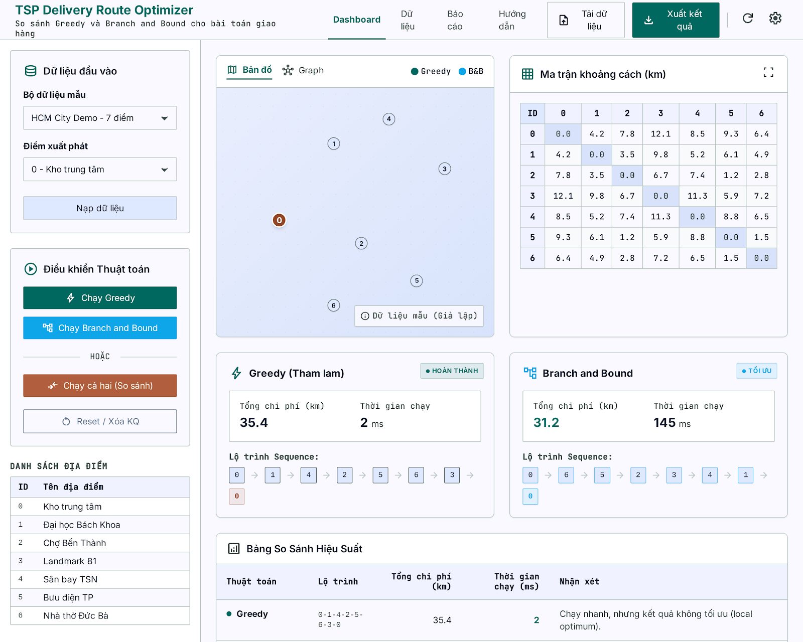
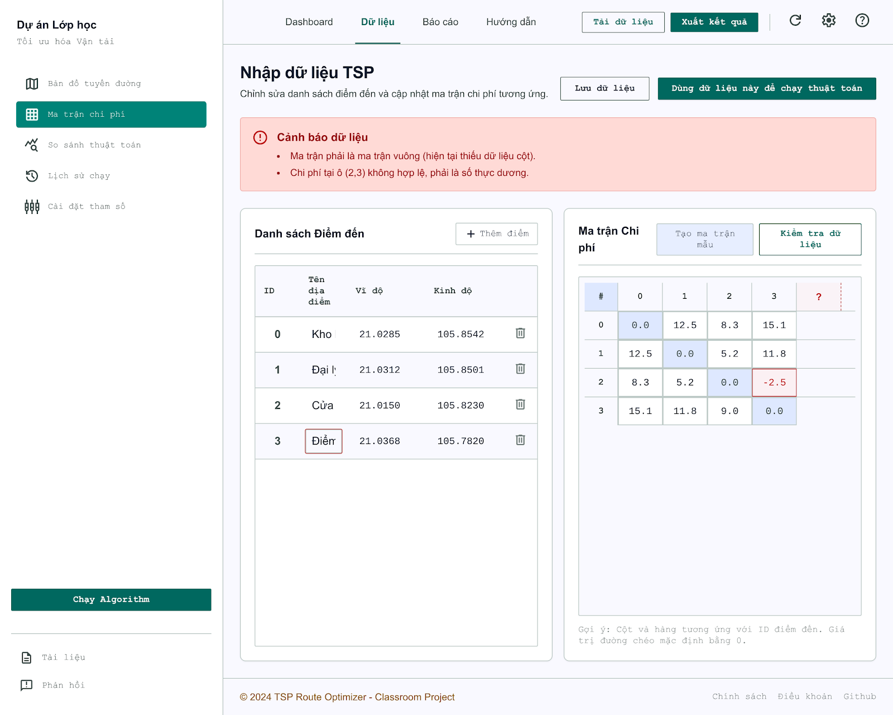
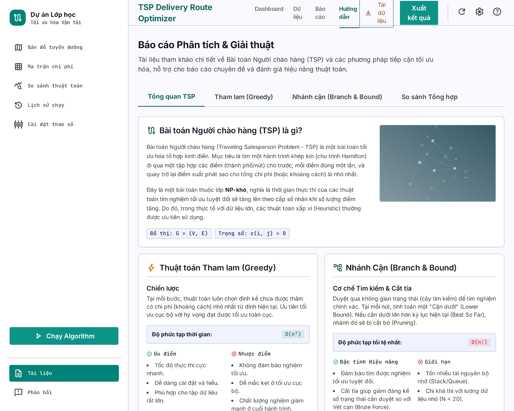
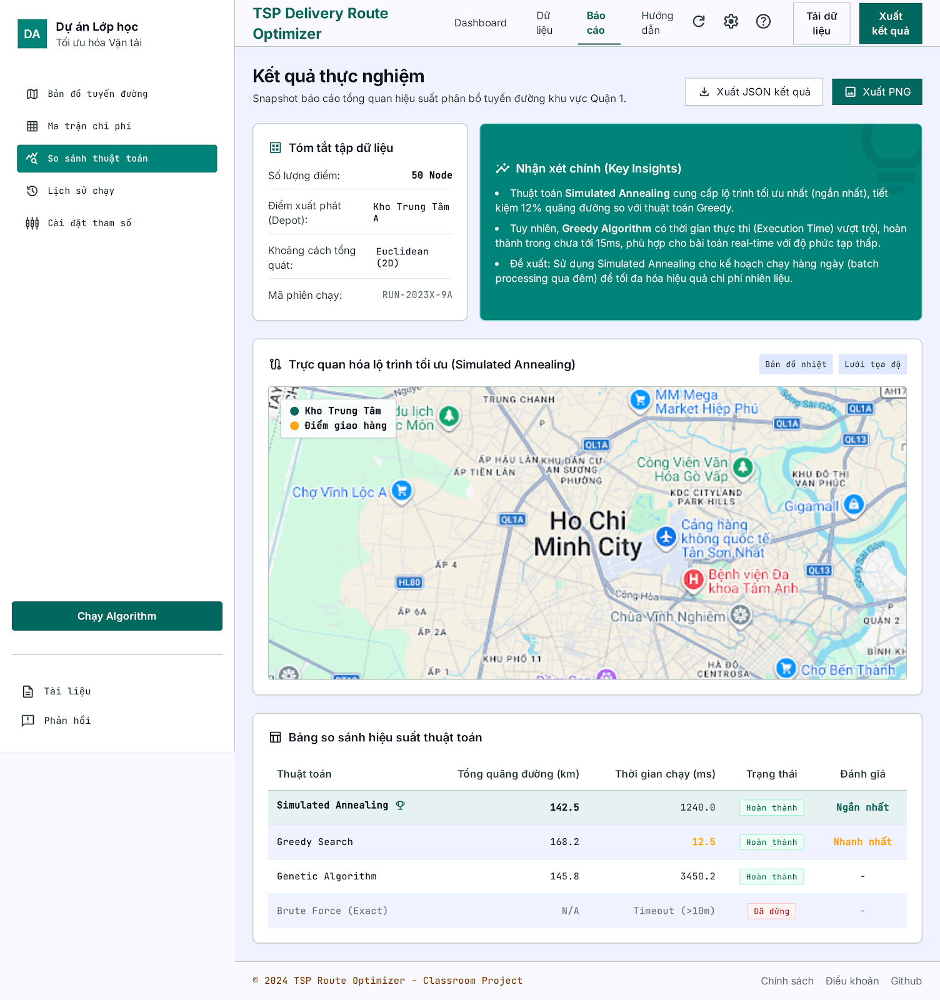

# TSP Delivery Route Optimizer

<p align="center">
  <strong>Classroom demo app for comparing Greedy nearest-neighbor and Branch and Bound on the Travelling Salesman Problem.</strong>
</p>

<p align="center">
  
  
  
  
</p>

<p align="center">
  <a href="#preview">Preview</a> ·
  <a href="#features">Features</a> ·
  <a href="#architecture">Architecture</a> ·
  <a href="#team-plan">Team Plan</a> ·
  <a href="docs/api-contract.md">API Contract</a>
</p>

## Preview



<table>
  <tr>
    <td width="50%">
      
    </td>
    <td width="50%">
      
    </td>
  </tr>
  <tr>
    <td colspan="2">
      
    </td>
  </tr>
</table>

## Overview

This project simulates a delivery route planner using the Travelling Salesman
Problem (TSP). Given a list of locations and a cost matrix, the app finds a tour
that starts from one location, visits every location exactly once, and returns to
the starting point.

The demo compares two strategies:

- **Greedy nearest-neighbor**: fast and simple, but not guaranteed to be optimal.
- **Branch and Bound**: finds the optimal route for small inputs, but becomes
  expensive as the number of locations grows.

## Features

| Area | Planned capability |
| --- | --- |
| Data input | Choose sample datasets or enter custom locations and cost matrix |
| Algorithms | Run Greedy and Branch and Bound from backend services |
| Comparison | Show route, total cost, runtime, and short algorithm notes |
| Visualization | Display route paths on a map or graph for presentation |
| Report support | Keep API contract, algorithm notes, test cases, and demo script in `docs/` |

## Architecture

```text
tsp-delivery-route-optimizer/
  backend/   Node.js + Express API and TSP algorithms
  frontend/  React + Vite + TypeScript user interface
  data/      Sample locations and cost matrices
  docs/      API contract, algorithm notes, tests, report, slides
  tools/     Optional generators and validators
```

## API At A Glance

Planned endpoints:

| Method | Endpoint | Purpose |
| --- | --- | --- |
| `POST` | `/api/solve/greedy` | Run Greedy nearest-neighbor |
| `POST` | `/api/solve/branch-and-bound` | Run Branch and Bound optimal solver |

Shared response shape:

```ts
type SolveResult = {
  route: number[];
  totalCost: number;
  runtimeMs: number;
};
```

See [docs/api-contract.md](docs/api-contract.md) for the full request and
response contract.

## Team Plan

The project is split into 4 parallel workstreams from **19/05/2026** to
**06/07/2026**.

| Member | Focus | GitHub issue |
| --- | --- | --- |
| Member 1 | Data model, sample matrices, Greedy solver | [#1](https://github.com/xuanhai0913/tsp-delivery-route-optimizer/issues/1) |
| Member 2 | Branch and Bound optimal TSP solver | [#2](https://github.com/xuanhai0913/tsp-delivery-route-optimizer/issues/2) |
| Member 3 | React UI, API integration, route visualization | [#3](https://github.com/xuanhai0913/tsp-delivery-route-optimizer/issues/3) |
| Member 4 | Testing, report, slides, demo script | [#4](https://github.com/xuanhai0913/tsp-delivery-route-optimizer/issues/4) |

## Development Status

Current state:

- Repository skeleton is ready.
- UI design previews from Stitch are included in `docs/assets/screenshots/`.
- Backend/frontend implementation has not started yet.
- No dependencies are installed yet.

Next milestone:

1. Scaffold backend and frontend TypeScript projects.
2. Add sample data and validation rules.
3. Implement Greedy and Branch and Bound APIs.
4. Build the main solver dashboard based on the preview screens.

## Documentation

- [API contract](docs/api-contract.md)
- [Algorithm notes](docs/algorithms.md)
- [Test cases](docs/test-cases.md)
- [Demo script](docs/demo-script.md)
- [Report outline](docs/report/README.md)
- [Slides outline](docs/slides/README.md)
