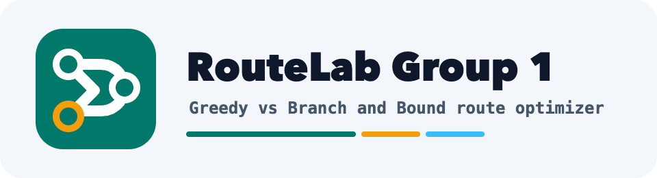

# RouteLab Group 1

<p align="center">
  
</p>

<p align="center">
  <strong>Classroom shortest-path lab for comparing Dijkstra and A* on weighted map graphs.</strong>
</p>

<p align="center">
  
  
  
  
</p>

<p align="center">
  <a href="https://maps.hailamdev.space">Live Frontend</a> ·
  <a href="#overview">Overview</a> ·
  <a href="#features">Features</a> ·
  <a href="#architecture">Architecture</a> ·
  <a href="#team-plan">Team Plan</a> ·
  <a href="docs/api-contract.md">API Contract</a> ·
  <a href="docs/database.md">Database</a>
</p>

## Live Frontend

Production frontend domain: [maps.hailamdev.space](https://maps.hailamdev.space)

The current frontend is deployed with graph demo data and a mock solver service.
The backend Dijkstra endpoint now returns real shortest-path results; A* API
wiring is still reserved for Member 2.

## Overview

This project simulates shortest-path search on a weighted map graph. Given a
source node, target node, nodes, and weighted edges, the app visualizes the path
with the lowest total cost.

The demo compares two strategies:

- **Dijkstra**: guarantees the shortest path for graphs with non-negative edge weights.
- **A\***: uses a coordinate heuristic `f(n) = g(n) + h(n)` to guide the search toward the target.

This is not an implementation of Google Maps. The map is used only as a
visual layer for a classroom graph algorithm demo.

## Features

| Area | Planned capability |
| --- | --- |
| Data input | Choose sample graph datasets or edit nodes and weighted edges |
| Algorithms | Run Dijkstra and A* from backend services |
| Comparison | Show path, total cost, runtime, visited nodes, and short notes |
| Visualization | Display explored graph and final path on a map or SVG graph |
| Database | Store graph datasets, nodes, weighted edges, road geometry, and future solver runs in PostgreSQL |
| Report support | Keep API contract, algorithm notes, test cases, and demo script in `docs/` |

## Architecture

```text
RouteLab Group 1/
  backend/   Node.js + Express API and shortest-path solvers
  frontend/  React + Vite + TypeScript user interface
  data/      Sample graph nodes and weighted edges
  docs/      API contract, algorithm notes, tests, report, slides
  tools/     Optional generators and validators
```

## API At A Glance

Planned endpoints:

| Method | Endpoint | Purpose |
| --- | --- | --- |
| `GET` | `/api/datasets` | List graph datasets |
| `GET` | `/api/datasets/:id` | Load one graph dataset |
| `POST` | `/api/solve/dijkstra` | Run Dijkstra solver |
| `POST` | `/api/solve/a-star` | Run A* solver |

Shared response shape:

```ts
type PathSolveResult = {
  path: number[];
  totalCost: number;
  runtimeMs: number;
  visitedOrder?: number[];
  relaxedEdges?: Array<{ from: number; to: number; cumulativeCost: number }>;
};
```

See [docs/api-contract.md](docs/api-contract.md) for the full request and
response contract.

## Team Plan

The project is split into 4 parallel workstreams from **19/05/2026** to
**06/07/2026**.

| Member | Focus | GitHub issue |
| --- | --- | --- |
| Member 1 | Graph data, request validation, Dijkstra solver | [#1](https://github.com/xuanhai0913/tsp-delivery-route-optimizer/issues/1) |
| Member 2 | A* solver, heuristic notes, comparison analysis | [#2](https://github.com/xuanhai0913/tsp-delivery-route-optimizer/issues/2) |
| Member 3 | React UI, API integration, map/graph visualization | [#3](https://github.com/xuanhai0913/tsp-delivery-route-optimizer/issues/3) |
| Member 4 | Testing, report, slides, demo script | [#4](https://github.com/xuanhai0913/tsp-delivery-route-optimizer/issues/4) |

## Development Status

Current state:

- Frontend UI is implemented and available at [maps.hailamdev.space](https://maps.hailamdev.space).
- Frontend currently uses mock graph data and mock Dijkstra/A* results.
- Backend exposes graph dataset APIs and shortest-path solve endpoints.
- Backend can read datasets from PostgreSQL when `DATABASE_URL` is configured, with JSON sample fallback for local demo.
- Backend solver implementation is intentionally pending in this migration commit.

Next milestone:

1. Implement backend Dijkstra solver.
2. Implement backend A* solver and heuristic notes.
3. Replace the frontend mock solver client with HTTP API calls.
4. Prepare final report screenshots from the production frontend domain.

## Documentation

- [API contract](docs/api-contract.md)
- [Database design](docs/database.md)
- [Algorithm notes](docs/algorithms.md)
- [Test cases](docs/test-cases.md)
- [Demo script](docs/demo-script.md)
- [Brand assets](docs/brand-assets.md)
- [Report outline](docs/report/README.md)
- [Slides outline](docs/slides/README.md)
